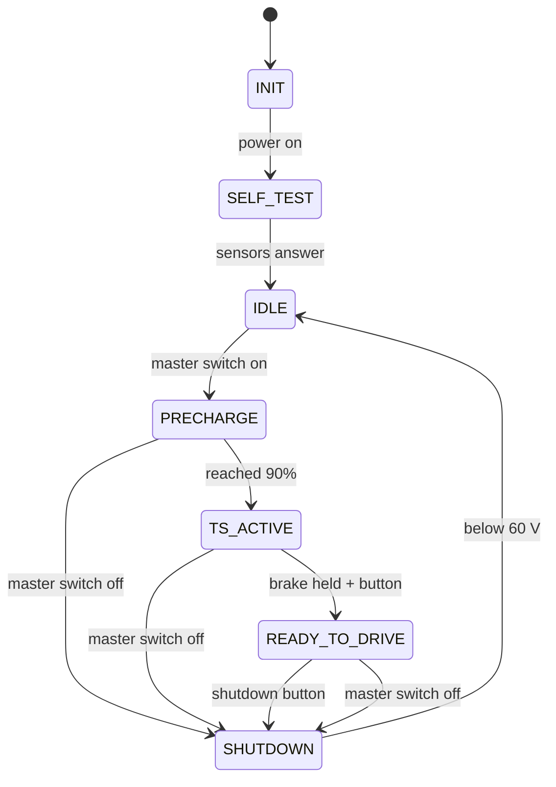
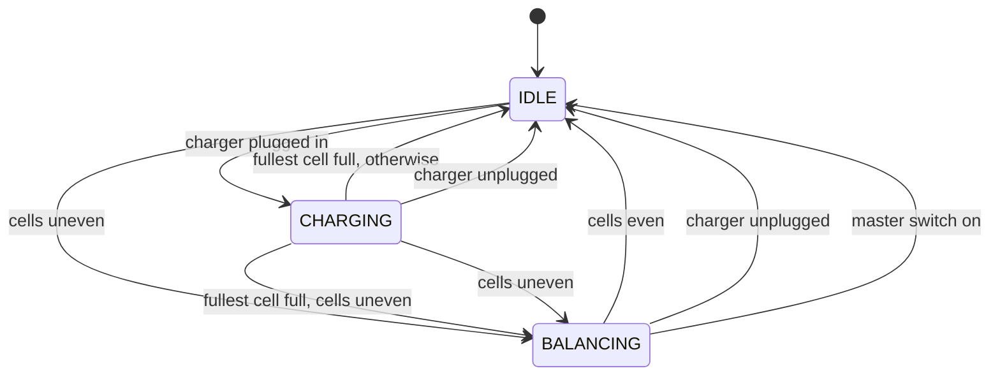
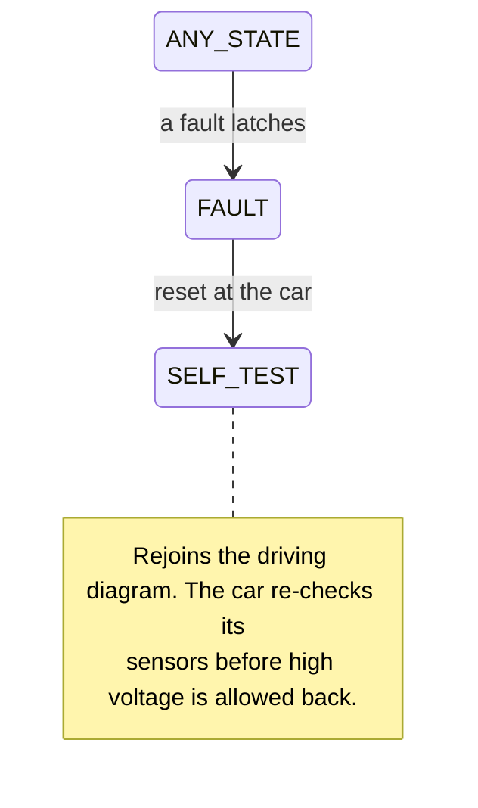

# SN5 Battery Management System

A Battery Management System (BMS) state machine for SN5, Berkeley Formula Electric's
electric racecar. Written for the Formula Electric Berkeley CS subteam recruitment
project.

**Author:** Lakshya Saini

---

## What this is

The battery in an electric racecar is called the **accumulator**. It holds enough
energy to be genuinely dangerous: 384 cells at around 346 volts. The BMS is the
software that watches it.

Its job is to know, continuously, whether the battery is safe — every cell's voltage,
the temperature at many points, how much current is flowing — and to disconnect the
battery from the rest of the car the moment anything is out of range. It also controls
the sequence for safely connecting the battery in the first place, since doing that
carelessly damages the motor controller.

This project implements that decision-making as a state machine: a set of defined
states the battery can be in, and explicit rules for moving between them. It runs as a
simulation, so the behaviour can be driven and inspected without a real battery.

Two things shaped every decision:

1. **Formula SAE competes under a rulebook**, and the rules specify much of what a BMS
   must do — what it monitors, when it must disconnect, how it recovers. Rather than
   invent sensible-looking behaviour, I worked from the Formula SAE Rules 2026
   (version 1.0, 10 September 2025) and cited the rule behind each decision in the
   code itself. Rule references like `EV.7.3.4` appear throughout.
2. **Limits come from the cell manufacturer's datasheet**, not from guesses.

---

## Running it

Python 3.10 or newer. No packages to install — the project uses only the Python
standard library.

```bash
cd feb-bms-sn5
```

**See everything verified at once** (this is the best starting point):

```bash
python3 -m sim.demo
```

Prints one page: the project requirements, how each safety threshold was derived, the
normal start-up sequence, every fault type being detected, the behaviour the rules
require, the CAN messages, and the test results. 34 checks, all computed by running
the real code.

**Watch a failure happen:**

```bash
python3 -m sim.run sim/scenarios/overtemp_during_drive.scn
```

**Run the tests:**

```bash
python3 -m unittest discover -s tests -t .
```

83 tests, about a quarter of a second.

---

## The ten states

Each state exists for a reason, and most of those reasons are in the rulebook.

| State | What it means | Why it exists |
|---|---|---|
| **INIT** | Just powered on | Somewhere to start before anything is known |
| **SELF_TEST** | Checking the sensors and relays | The rules require the BMS to detect missing readings and faults in itself (EV.7.3.4 d, e). If a sensor is not answering, the car must not start |
| **IDLE** | Low-voltage electronics on, battery disconnected | The safe resting state. The BMS is watching the battery but no high voltage leaves it |
| **PRECHARGE** | Gently charging the motor controller's capacitors | Connecting 346 V directly to empty capacitors causes a huge inrush current that damages contactors. So current is first fed through a resistor until the far side has caught up. Required by EV.5.6 |
| **TS_ACTIVE** | High voltage is live, but the motors will not respond | A deliberate intermediate step. The car is electrically awake but cannot move (EV.9.4) |
| **READY_TO_DRIVE** | Motors respond to the accelerator | Reached only when the driver does something deliberate, never automatically (EV.9.6.2) |
| **CHARGING** | Plugged into the charger | Charging has stricter temperature limits than driving, so it needs its own state |
| **BALANCING** | Draining the fullest cells slightly | Cells drift apart over time. The charge stops when the fullest cell is full, which leaves the others short, so the full ones are bled down to let the rest catch up |
| **SHUTDOWN** | Disconnecting and confirming it worked | The rules give five seconds for the high voltage to drop below 60 V (EV.7.2.2 c). This state verifies it actually did |
| **FAULT** | Something is wrong; the battery is disconnected | Latched. It does not clear itself, and the driver cannot clear it from inside the car — someone has to walk over and reset it (EV.7.2.3) |

### How they connect

Three views of the same transition table, split because one picture of twenty
labelled arrows is too wide to read comfortably.

**Driving**



**Charging and balancing**



**Faults, which can happen in any state**



All three diagrams and the table below are **generated from the transition table**
in `bms/state_machine.py` rather than drawn by hand, so the pictures cannot drift
away from the behaviour. A test checks that every transition appears in exactly one
of the three, so none can quietly go missing.

#### Every transition

| From | Trigger | To | Rule |
|---|---|---|---|
| INIT | power on | SELF_TEST | - |
| SELF_TEST | sensors answer | IDLE | EV.7.3.4 d,e |
| IDLE | master switch on | PRECHARGE | EV.9.2 |
| IDLE | charger plugged in | CHARGING | EV.8.3 |
| IDLE | cells uneven | BALANCING | EV.7.3.3 |
| PRECHARGE | reached 90% | TS_ACTIVE | EV.5.6.1 a |
| PRECHARGE | master switch off | SHUTDOWN | EV.7.2.1 |
| TS_ACTIVE | brake held + button | READY_TO_DRIVE | EV.9.6.2 |
| TS_ACTIVE | master switch off | SHUTDOWN | EV.7.2.1 |
| READY_TO_DRIVE | shutdown button | SHUTDOWN | EV.7.2.1 |
| READY_TO_DRIVE | master switch off | SHUTDOWN | EV.7.2.1 |
| CHARGING | fullest cell full, cells uneven | BALANCING | EV.7.3.3 |
| CHARGING | fullest cell full, otherwise | IDLE | - |
| CHARGING | charger unplugged | IDLE | - |
| CHARGING | cells uneven | BALANCING | EV.7.3.3 |
| BALANCING | cells even | IDLE | - |
| BALANCING | charger unplugged | IDLE | - |
| BALANCING | master switch on | IDLE | - |
| SHUTDOWN | below 60 V | IDLE | EV.7.2.2 c |
| FAULT | reset at the car | SELF_TEST | EV.7.2.3 |
| any state | a fault latches | FAULT | EV.7.3.5 |


Where two arrows leave the same state on the same trigger, the condition that
separates them is named in the label.

A normal start-up looks like this:

```
  0.010 s  INIT            -> SELF_TEST       TICK
  0.020 s  SELF_TEST       -> IDLE            SELF_TEST_PASS
  0.030 s  IDLE            -> PRECHARGE       TSMS_CLOSED
  0.730 s  PRECHARGE       -> TS_ACTIVE       PRECHARGE_DONE
  1.540 s  TS_ACTIVE       -> READY_TO_DRIVE  RTD_REQUEST
```

---

## Safety limits and where they come from

The rules say something easy to miss: limits must be respected *"considering
measurement accuracy"* (EV.7.4.2, EV.7.5.2). A sensor that reads 59 °C when the cell
is really 61 °C has broken the limit while appearing not to. So the point at which the
BMS actually trips is the real limit pulled back by the error of the sensor checking
it.

| Quantity | Limit | Sensor accuracy | Trips at | Source |
|---|---|---|---|---|
| Cell voltage, high | 4.200 V | 0.025 V | **4.175 V** | Datasheet, EV.7.4.2 |
| Cell voltage, low | 2.500 V | 0.025 V | **2.525 V** | Datasheet, EV.7.4.2 |
| Cell temperature | 60.0 °C | 2.0 °C | **58.0 °C** | EV.7.5.2 |
| Charging temperature, low | 0.0 °C | 2.0 °C | **2.0 °C** | Datasheet |
| Charging temperature, high | 45.0 °C | 2.0 °C | **43.0 °C** | Datasheet |
| Discharge current | 80.0 A | 1.0 A | **79.0 A** | Datasheet |

The temperature ceiling is worth explaining. The rules cap cells at 60 °C *or* the
datasheet limit, whichever is lower (EV.7.5.2). These cells allow 60 °C, so the cap is
60 — and with 2 °C of sensor error, the BMS trips at 58.

Charging limits are tighter than driving limits at both ends, because pushing current
into a cell that is too cold or too hot damages it. The same 44 °C reading is therefore
fine while driving and a fault while charging.

All of these live in one file, `bms/config.py`, each annotated with its source.

> **Note on the cell data.** The recruitment packet says the previous car, SN4, used an
> off-the-shelf Energus 1s4p module. I was not able to retrieve that exact datasheet, so
> the cell figures above are the published values for the Samsung INR18650-25R cells
> those modules are built from. They are marked as provisional in `config.py` and should
> be confirmed against the real datasheet. The structure does not change either way —
> only the numbers in one file.

---

## The pack

| | |
|---|---|
| Arrangement | 96 modules in series, each module 4 cells in parallel |
| Total cells | 384 |
| Voltage | 346 V nominal, 403 V at full charge |
| Capacity | 10 Ah |
| Voltage measurements | 96 — one per module |
| Temperature sensors | 96, covering 25% of cells |

Two rule checks are built into the configuration itself, so an illegal pack fails
immediately at start-up rather than at inspection:

- **Temperature coverage must be at least 20%** of cells (EV.7.5.5). This pack monitors
  25%. Note that older Formula SAE material says 30% — the 2026 rules lowered it to 20.
- **No more than 600 V** anywhere in the system (EV.3.3.2). This pack peaks at 403 V.

Cells wired directly in parallel only need one voltage measurement between them
(EV.7.4.1), which is why 384 cells need 96 measurements rather than 384.

---

## What the BMS watches for

The rules list five things a BMS must monitor (EV.7.3.4). All five are implemented,
including the three that are easy to overlook:

| Watching for | Rule |
|---|---|
| Cell voltage outside its range | EV.7.3.4 a |
| A blown fuse on the voltage-sensing wires | EV.7.3.4 b |
| Cell temperature outside its range | EV.7.3.4 c |
| A reading that is missing or has stopped updating | EV.7.3.4 d |
| A fault inside the BMS itself | EV.7.3.4 e |

Plus four that the rules do not require but a real car needs: current over the
datasheet limit, a connection sequence that never completes, an insulation monitoring
fault, and a contactor that has welded itself shut.

That last one is worth a note. The BMS keeps what it *commanded* the contactors to do
separate from what the contactors *report*. A relay that was told to open but still
reads closed has welded shut — a real failure that leaves high voltage live when the
car believes it is safe.

### Three things the fault handling does deliberately

**It waits before believing a bad reading.** A single noisy sample should not shut the
car down mid-corner, so a condition has to persist before it counts: 50 milliseconds
for voltage, 200 for temperature. Temperature gets longer because a battery's thermal
mass means it physically cannot jump 20 degrees in one sample — if it appears to, the
sensor is lying.

A missing reading gets **no** waiting period at all. That is not noise; it is the
sensor saying it cannot see.

**Faults do not clear themselves.** Once tripped, the BMS stays in FAULT. Attempting a
reset while the problem is still present does nothing — pressing the button on a pack
that is still too hot achieves nothing, which is what EV.7.2.3 intends. And a reset
arriving over the car's data bus is rejected, because the rules require a person
physically at the car and forbid the driver re-arming it from the seat.

**It remembers which fault came first.** One failure causes others within milliseconds:
an overheating cell sags under load and trips a low-voltage fault too. By the time
anyone looks, several faults are flagged and the original cause is lost. So the first
one is recorded separately, with the sensor that saw it, the reading, the limit it
broke, and when:

```
CELL_OVERTEMP ch30 measured=58.8 limit=58 in READY_TO_DRIVE at 8710 ms [EV.7.5.2]
```

---

## How the code is organised

The state machine does not touch hardware, read a clock, or keep hidden state. It
takes a set of readings and returns a set of commands. That is what makes it
testable: the same inputs always produce the same outputs, and a ten-second scenario
runs in a millisecond.

| File | What it does |
|---|---|
| `bms/types.py` | The vocabulary: the ten states, the events, the fault codes |
| `bms/config.py` | Every limit and timing value, each with its source |
| `bms/inputs.py` | What the BMS can see: sensor readings and driver actions |
| `bms/outputs.py` | What the BMS commands: relays, warning lights, motor enable |
| `bms/monitor.py` | Reduces 96 readings to the few facts that matter |
| `bms/faults.py` | Decides whether those facts are acceptable, and remembers if not |
| `bms/state_machine.py` | The states, the transition table, and one step per tick |
| `bms/can.py` | The messages the BMS puts on the car's data bus |
| `sim/run.py` | Replays a scenario and prints what happened |
| `sim/scenario.py` | Reads the scenario files |
| `sim/demo.py` | The verification run |
| `tests/` | 83 tests |

### Two structural choices

**Outputs depend only on the current state, never on how the state was reached.** A
contactor's position is a property of where the car is, not of the path it took to get
there. This means the correct outputs can be checked one state at a time.

**The transitions are stored as data, not written as code.** Each one is a row holding
where it comes from, what triggers it, where it goes, what condition must hold, and
which rule it satisfies. Twenty rows. Adding a state means adding rows rather than
editing logic — and it is why the diagram above can be generated rather than drawn.

The one exception: entering FAULT is handled separately, because it can happen from
any state. Writing that as a table row for every state would mean twenty
near-identical rows.

---

## Testing

83 tests, plus 8 end-to-end scenarios, plus the 34-check verification run.

| Area | Tests |
|---|---|
| Reading the pack | 9 |
| Fault handling | 24 |
| The state machine | 31 |
| Data bus messages | 12 |
| Full scenarios | 7 |

What the tests check, beyond the obvious:

- **Thresholds from both sides.** A cell at 4.17 V must *not* fault; at 4.18 V it must.
- **Timing boundaries.** A condition lasting 40 ms must not trip a 50 ms limit; 50 ms
  must.
- **Transient rejection.** A brief spike, a gap, then another brief spike must not add
  up to a fault.
- **Connection by measurement, not by clock.** Held at 89% for four seconds, the car
  must stay in PRECHARGE. This matters because the rules require the step to end on a
  voltage measurement rather than a timer (EV.5.6.2 a).
- **All three conditions for driving.** Brake alone, button alone, and both without
  high voltage are each refused.
- **Latching and recovery.** The fault persists after the cause disappears; a reset is
  refused while the cause is present; a reset over the data bus is refused entirely.
- **Transitions that must not exist.** There is no path from IDLE straight to live high
  voltage that skips the connection sequence.

### Scenarios

Each is a short text file describing inputs over time, and each one's outcome is
asserted by a test.

| Scenario | What it shows |
|---|---|
| `normal_drive` | Power up, connect, drive, shut down cleanly |
| `precharge_fail` | The connection sequence never completes, so the car faults |
| `overtemp_during_drive` | A module overheats on track |
| `cell_undervolt` | A cell collapses under load |
| `sense_wire_loss` | The voltage sensing chain stops responding |
| `air_weld` | A contactor welds shut |
| `charge_cycle` | A full charge, then balancing the cells |
| `fault_reset_sequence` | A fault, the cause clearing, then a manual reset |

They read like this:

```
@0      glv on
@200    tsms on
@2000   brake on
@2100   start press
@4000   ramp cell_temp[30:34] 40 -> 64 over 6000
end     12000
```

The simulator also models the physical behaviour of the motor controller's capacitors
charging and draining. That turns one rule from a claim into a measurement: after
disconnecting, the high voltage falls below 60 V in 1.45 seconds, against the five
seconds the rules allow.

---

## Data bus messages

Racecars distribute data over a CAN bus. Six messages are sent, two received, each
built by hand so the byte layout is visible.

| Identifier | Message | Rate | Contents |
|---|---|---|---|
| `0x180` | Status | 100 Hz | Current state, relay positions, warning lights |
| `0x181` | Pack summary | 10 Hz | Pack voltage and current, highest and lowest cell |
| `0x182` | Cell voltages | 10 Hz | Sent in blocks — 96 cells do not fit in one message |
| `0x183` | Cell temperatures | 10 Hz | Also in blocks |
| `0x184` | Faults | On change | Active faults plus the first-fault record |
| `0x300` | Charger control | 10 Hz | Requested voltage and current |
| `0x200` | Charger status | received | |
| `0x201` | Dashboard command | received | |

The fault message is sent the instant anything changes rather than waiting for its
next scheduled slot, and carries the first-fault record so a laptop connected
afterwards can still find out what happened.

A dashboard request to clear a fault is **counted and refused**, for the reason above.
A request to start the car is accepted, since a dashboard button is still the driver
acting in the cockpit. Only resetting must be physical.

---

## Rules referenced

All from Formula SAE Rules 2026, version 1.0 (10 September 2025).

| Rule | What it requires |
|---|---|
| EV.3.3.2 | No more than 600 V anywhere |
| EV.5.4 | At least two disconnect relays, both normally open |
| EV.5.6.1 a | Connect gradually to 90% before closing the second relay |
| EV.5.6.2 a | Decide that by voltage measurement, not a timer |
| EV.5.6.3 | A circuit that drains the motor controller when disconnected |
| EV.7.1.3 | The BMS's switch must be open when unpowered |
| EV.7.2.2 c | High voltage below 60 V within five seconds of disconnecting |
| EV.7.2.3 | Stays disabled until a person resets it at the car |
| EV.7.3.1 | Monitor while driving and while charging |
| EV.7.3.3 | No cell balancing while the safety circuit is open |
| EV.7.3.4 | The five things that must be monitored |
| EV.7.3.5 | On a fault: disconnect and light the warning lights |
| EV.7.3.6 | The warning light must be red and visible to the driver |
| EV.7.4.1 | Measure every cell's voltage |
| EV.7.4.2 | Stay inside datasheet limits, allowing for sensor accuracy |
| EV.7.5.2 | Temperature below the datasheet limit or 60 °C, whichever is lower |
| EV.7.5.5 | At least 20% of cells temperature-monitored, evenly spread |
| EV.8.3, EV.8.4 | Charging has its own safety circuit |
| EV.9.2 | The order systems must come alive in |
| EV.9.6.2 | Driving requires high voltage, the brake held, and a deliberate action |
| EV.9.7.2 | A sound lasting one to three seconds when ready to drive |
| T.9.1.2 | "Low voltage" means 60 V or less |

The rulebook and cell datasheet are copyrighted, so they are referenced by number here
rather than included in this repository.

Worth noting: the 2026 rules renamed this system from AMS (Accumulator Management
System) to BMS (Battery Management System), and lowered the temperature monitoring
requirement from 30% of cells to 20%. Older Formula SAE material and many teams still
use the earlier terms and numbers.

---

## What this does not do

Stated plainly, because knowing the boundary matters as much as the work inside it.

- **It is a simulation.** There is no real hardware, and the CAN messages go to a
  stand-in rather than a real bus. The state machine is written so that swapping the
  simulated inputs for real sensor readings would not change it.
- **It does not estimate remaining charge.** Tracking state of charge properly means
  integrating current over time and correcting for temperature and cell ageing. That is
  a substantial piece of work and was left out deliberately.
- **Balancing is simplified.** The decision of which cells to drain is implemented, but
  real balancing happens *during* charging rather than as a separate step, and how long
  to drain for depends on the hardware.
- **It does not limit regenerative braking current when the cells are cold.**
  Pushing current into a cold cell damages it, whichever direction the car is
  travelling. A production BMS reduces how much braking energy goes back into the
  battery at low temperature; it does not disconnect the battery, because that would
  stop the car. This version applies the driving temperature range whenever the car
  is driving, and leaves that current limiting out. Adding it needs control over
  motor torque, which this project does not model.
- **The first-fault record is not saved to permanent storage.** It is held in memory and
  broadcast on the bus. If the car's power is cut before anyone reads it, it is lost.
  Writing it to flash memory would fix that and is the first thing I would add.
- **Cell limits need confirming** against the real module datasheet, as noted above.

---

## Bugs found and fixed

Six, in two groups. The first three surfaced while writing tests and scenarios — the
behaviour was wrong and a test caught it. The last three came from a deliberate review
pass afterwards, looking for problems no existing test would find.

**Clearing a fault re-armed the car instantly.** If the driver's foot was on the brake
and thumb on the button when the fault happened — which is exactly when a fault
happens — resetting it put the car straight back into ready-to-drive. The rules require
a *deliberate action* to start driving, and a button already held is not an action. The
fix was to require a fresh press, detected as a change rather than a level.

**A finished charge restarted itself.** Charging completed, the car returned to idle,
saw the charger still plugged in, and started charging again, forever. The fix was to
check whether a charge is actually needed before starting one.

**Charge completion was measured on the wrong cell.** I had it finish when the
*lowest* cell was full, which would overcharge the highest one. Worse, it made
balancing unreachable: if being full meant every cell was full, a full pack could
never be out of balance. Measuring the highest cell instead is both correct and the
reason balancing exists at all — the fullest cell stops the charge while the others are
still short.

### Found by reviewing, not by testing

**Regenerative braking was mistaken for charging.** This is the one that mattered. The
temperature limit while charging is much tighter than while driving — 43 °C against
58 °C — because pushing current into a hot cell damages it. I was choosing between those
limits partly by whether current was flowing *into* the pack, and under regenerative
braking it is. So a pack at 47 °C, entirely legal on track and eleven degrees inside the
driving limit, faulted the moment the driver lifted off the accelerator — which
disconnects the battery, stops the car, and needs someone to walk out and reset it.

Eighty-three tests missed this, and the reason is worth more than the fix: every
charging test also set the charging state, so current direction and state always moved
together and nothing ever tested them apart. Coverage is not a count of tests; it is
whether the tests can tell two things apart. The state now decides the limits.

**Two welded contactors could hide each other.** Both shared a single fault code, and
active faults are held in a table indexed by code, so the two overwrote each other and
only one was ever reported. With both welded, the crew would be told about one and go
looking at the wrong half of the car. Each contactor now has its own code.

The obvious fix — indexing that table by which sensor reported the problem — would have
been smaller and worse. Voltage and temperature faults report whichever cell is
currently the most extreme, and that changes between readings, so the timer that waits
for a fault to persist would have restarted every time it changed and a real fault would
never have registered. That reasoning is recorded next to the code.

**A counter overflowed after fifty days.** The time-since-startup field sent on the data
bus was four bytes with nothing limiting the value written into it, so a pack left
powered for about fifty days crashed the messaging layer. It now wraps instead.

---

## Deliverables

| Required | Where |
|---|---|
| State machine diagram | Above, generated from the code |
| Code architecture and reasoning | "How the code is organised" |
| How it was tested | "Testing" |
| Repository | https://github.com/Lakshya-0910/feb-bms-sn5 |

---

Lakshya Saini
